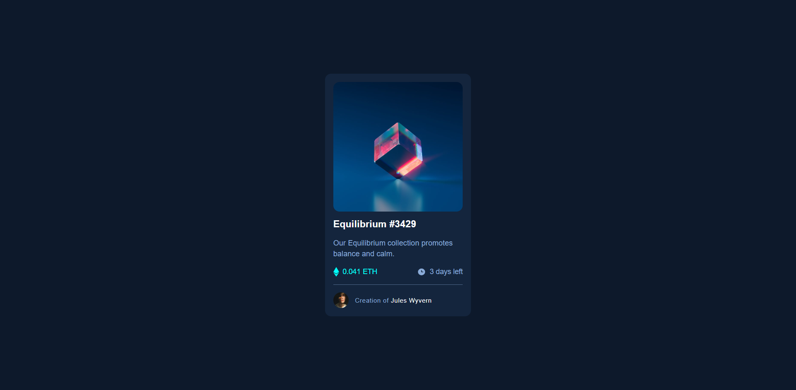

# Frontend Mentor - NFT preview card component solution

This is a solution to the [NFT preview card component challenge on Frontend Mentor](https://www.frontendmentor.io/challenges/nft-preview-card-component-SbdUL_w0U). Frontend Mentor challenges help you improve your coding skills by building realistic projects. 

## Table of contents

- [Overview](#overview)
  - [The challenge](#the-challenge)
  - [Screenshot](#screenshot)
  - [Links](#links)
- [My process](#my-process)
  - [Built with](#built-with)
  - [What I learned](#what-i-learned)
- [Author](#author)
- [Acknowledgments](#acknowledgments)

## Overview

The NFT Preview Card component is a visually appealing and interactive element designed to showcase and highlight non-fungible tokens (NFTs). It offers a concise overview of an NFT, including its image, title, artist, and key details, to capture the viewer's attention. The component provides a seamless user experience by allowing users to interact with the card, view additional information, and take actions such as liking, sharing, or purchasing the NFT.

Building the NFT Preview Card component involved implementing responsive design principles to ensure optimal display on various screen sizes. It required leveraging HTML, CSS, and JavaScript to create a visually captivating layout and incorporating dynamic data binding techniques to populate the card with NFT information. Additionally, attention was given to incorporating interactive features such as hover effects, animations, and click events to enhance user engagement and create an immersive preview experience. Through developing this component, I gained proficiency in front-end development, UI design, and creating interactive components that effectively showcase NFTs in an engaging and visually appealing manner.

### The challenge

Users should be able to:

- View the optimal layout depending on their device's screen size
- See hover states for interactive elements

### Screenshot

### Links

- Solution URL: [Solution Repository](https://your-solution-url.com)
- Live Site URL: [Live Demo](https://your-live-site-url.com)

## My process

### Built with

- Semantic HTML5 markup
- CSS custom properties
- Flexbox
- CSS Grid
- Mobile-first workflow
- [React](https://reactjs.org/) - JS library

### What I learned

## Author

- Website - [Jalaj](https://wolfgunblood.github.io/portfolio/)
- Frontend Mentor - [@wolfgunblood](https://www.frontendmentor.io/profile/wolfgunblood)
- Twitter - [@jalaj_dorai](https://twitter.com/jalaj_dorai)

## Acknowledgments

I would like to express our gratitude to Frontend Mentor (https://www.frontendmentor.io) for providing the design and inspiration for this project. Frontend Mentor offers a vast collection of design challenges and projects that allow developers to enhance their skills by building real-world applications.
